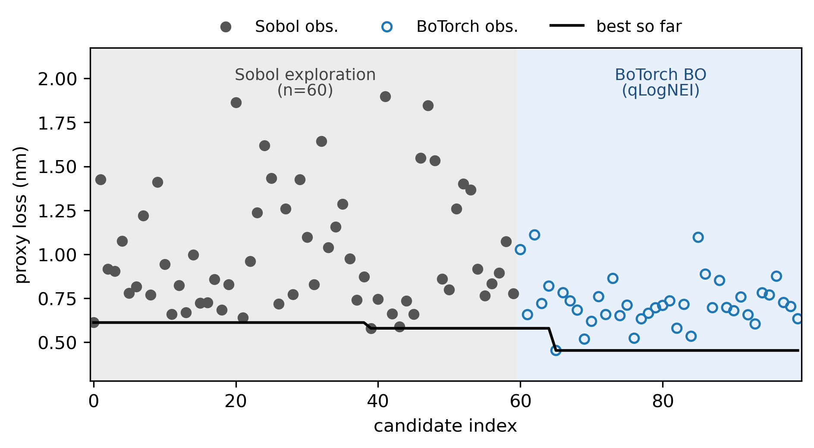
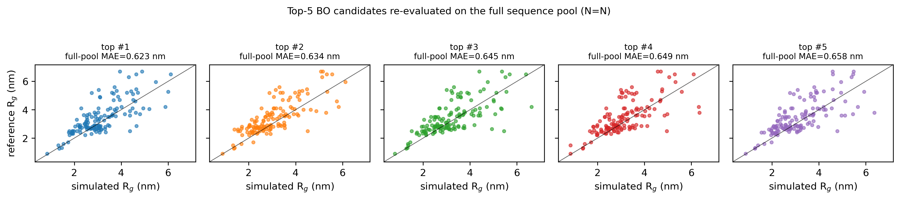
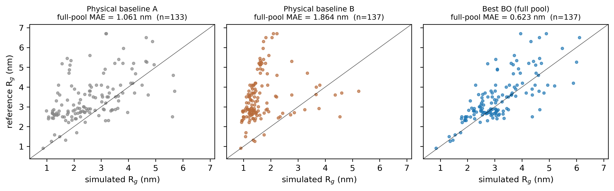

# Sample results

Representative slice of a real campaign, anonymised for public release.
Sequence labels have been replaced with `seqXXX` indices and parameter
values are not exposed.

## BO loss curve



* X axis: candidate index in proposal order.
* Y axis: proxy loss (weighted MAE of fixed10 + random10 sequences, in nm).
* Gray band: Sobol exploration phase (`bo.n_initial_sobol = 60`).
* Blue band: BoTorch optimization phase (Ax → qLogNEI).
* Open blue circles: BoTorch observations.
* Filled gray circles: Sobol observations.
* Black line: cumulative best-so-far.

The best-so-far drops noticeably once BoTorch takes over from Sobol —
the proxy loss falls from ~0.58 nm (best Sobol) to ~0.45 nm (best BO).

## Top-5 BO candidates re-evaluated on the full pool



The *top-5 BO candidates from the stratified campaign* were re-run with
**every** sequence in the reference pool to confirm the proxy loss is
unbiased. Each panel plots simulated R$_g$ vs. reference R$_g$ on a
y = x diagonal; the per-panel MAE is computed over the full pool, not
the 20-sequence subset the BO actually saw. The MAEs are all within
~0.05 nm of one another, which is the kind of dispersion you'd expect
from stochastic MD trajectories alone — the proxy is unbiased.

## Before vs. after — physical baselines vs. optimised parameters



The "before" here is **not** an early-Sobol candidate — it is two
parameter tables derived from two **different physical properties**,
the natural priors you would use without any optimisation. Both are
evaluated with the same simulator and the same protocol; the *only*
thing that changes between panels is the parameter table.

* **Physical baseline A** — parameters derived from one published
  physical prior.
* **Physical baseline B** — parameters derived from a second,
  independent physical prior.

The "after" is the lowest-MAE candidate from the BO campaign,
re-evaluated on the full sequence pool.

| panel               | full-pool MAE (nm) | RMSE (nm) | Pearson r | n   |
|---------------------|--------------------|-----------|-----------|-----|
| Physical baseline A | 1.061              | 1.367     | 0.51      | 133 |
| Physical baseline B | 1.864              | 2.153     | 0.22      | 137 |
| Best BO (full)      | 0.623              | 0.839     | 0.74      | 137 |

How to read the MAE drop:

* **Baseline B → BO**: 1.864 → 0.623 nm, a **~67% reduction**.
  Baseline B systematically biases the predictions in one direction
  (most points sit below the y = x diagonal); the BO-optimised
  parameters break that bias.
* **Baseline A → BO**: 1.061 → 0.623 nm, a **~41% reduction**.
  Baseline A is the better physical prior — it reproduces the rank
  order of the per-sequence target roughly correctly (r ≈ 0.51) — but
  BO still tightens the spread by almost half and lifts r to ≈ 0.74.
* **Pearson r**: rises from 0.22 and 0.51 on the two baselines to 0.74
  after optimisation. The BO-optimised parameters do not just shift
  the cloud toward the diagonal, they actually predict *which*
  sequences fall higher or lower than others.

The 4 missing points in the baseline A panel are sequences that
crashed in that baseline run; they are present in the other two panels
(n = 137).

## Follow-up: CVaR-80 with warm-start and Sobol expansion

After the headline campaign above, we ran a follow-up campaign
to see whether the result could be pushed further with a more careful
objective and a warmer start:

* **Objective**: instead of the unweighted Huber mean, the objective
  was `0.7 * mean_huber + 0.3 * CVaR80_huber` (with `cvar_fraction = 0.20`).
  CVaR80 penalises the worst 20% of sequences specifically, so the
  optimiser is no longer free to trade large errors on a few sequences
  for small gains on the bulk.
* **Warm start**: the top 20 candidates from the original campaign
  (re-evaluated on the full 137-sequence pool) were injected as warm
  trials, plus the top 5 by qNEI acquisition value.
* **Extra Sobol**: 10 fresh Sobol points were added on top of the warm
  start to keep some exploration around the warm region.
* **Pool**: 137 sequences per candidate (no proxy — the worker pool was
  big enough to run the full pool every trial).

After 83 trials (25 warm + 10 sobol_expand + 48 qLogNEI), the best
candidate reached full-pool MAE **≈ 0.589 nm** — a ~5 % relative
improvement over the original campaign's 0.623 nm. That improvement is
within the same ~0.02 – 0.05 nm dispersion we see between the top-5
candidates of either campaign (i.e. within MD trajectory noise), so we
read this as: **the original stratified campaign already sat on the
plateau**. CVaR80 + warm-start + sobol_expand did not unlock a new
regime; it confirmed the plateau.

Two takeaways for future runs:

1. The proxy loss (fixed10 + random10) was clearly good enough for
   navigation — the warm-start ranking from the proxy was preserved
   when the same candidates were re-scored on the full pool.
2. Once the optimiser is on the plateau, CVaR80 reshapes which
   sequences carry the most weight but does not move the headline MAE
   meaningfully. If the goal is a further drop, the lever is the model
   (force field, simulation protocol, sequence pool composition), not
   the BO objective.

## Headline numbers

| metric                                | value             |
|---------------------------------------|-------------------|
| sequence pool size, *N*               | 137               |
| simulations per candidate (proxy)     | 20                |
| compute saving vs. full sweep         | ~6.85×            |
| Sobol candidates                      | 60                |
| BoTorch candidates                    | 40                |
| Physical baseline A full-pool MAE     | 1.061 nm          |
| Physical baseline B full-pool MAE     | 1.864 nm          |
| Best BO            full-pool MAE      | 0.623 nm          |
| MAE reduction Baseline B → BO         | ~67 %             |
| MAE reduction Baseline A → BO         | ~41 %             |
| CVaR80 follow-up best full-pool MAE   | 0.589 nm (≈plateau) |

## Files in `results_release/`

* `observations_curve.png` — the loss-curve figure above.
* `before_after.png` — physical baseline A vs physical baseline B vs
  Best BO, all on the full pool.
* `top5_vs_full.png` — top-5 BO candidates vs full-pool MAE.
* `observations_anon.csv` — proxy-loss history with parameter columns
  stripped. Columns: `candidate_index`, `status`, `loss`,
  `fixed_mae_nm`, `random_mae_nm`, `phase`.
* `candidates_examples/` — three illustrative candidate folders. Each
  holds:
    * `params.json` — only the parameter-vector dimensionality (numeric
      values are intentionally omitted).
    * `loss.csv` — full-pool loss summary for the candidate.

## Reproducing these plots

```bash
python -m tools.anonymize_results \
    --stratified-dir <stratified-campaign>/runs/<live> \
    --validation-dir <validation-campaign>/runs/<full-pool-rerun> \
    --n-initial-sobol 60 \
    --baseline-a-csv <baseline-a>/per_sequence_summary.csv \
    --baseline-b-csv <baseline-b>/per_sequence_summary.csv \
    --out-dir results_release
```

Both campaign directories must look like a `runs/<campaign>/` folder
produced by this controller (`state.json`, `observations.csv`,
`candidates/cand_NNNN/{candidate.json, loss.csv, sequence_results.csv}`).
The two baseline CSVs only need the columns
`label, exp_rg_nm, sim_rg_nm, abs_error_nm` (the script also accepts
the legacy column names `sim_rg_lastframe_nm` and `abs_delta_nm`).
